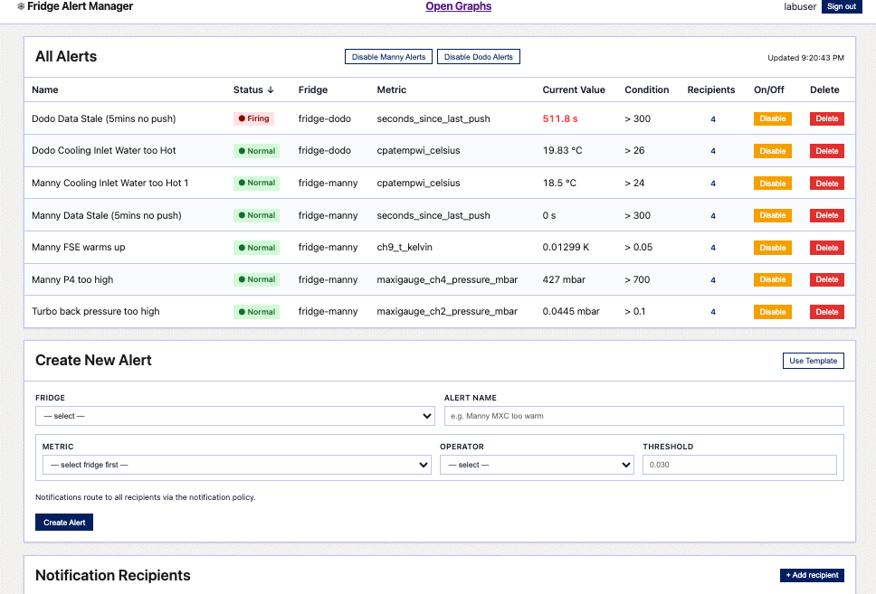
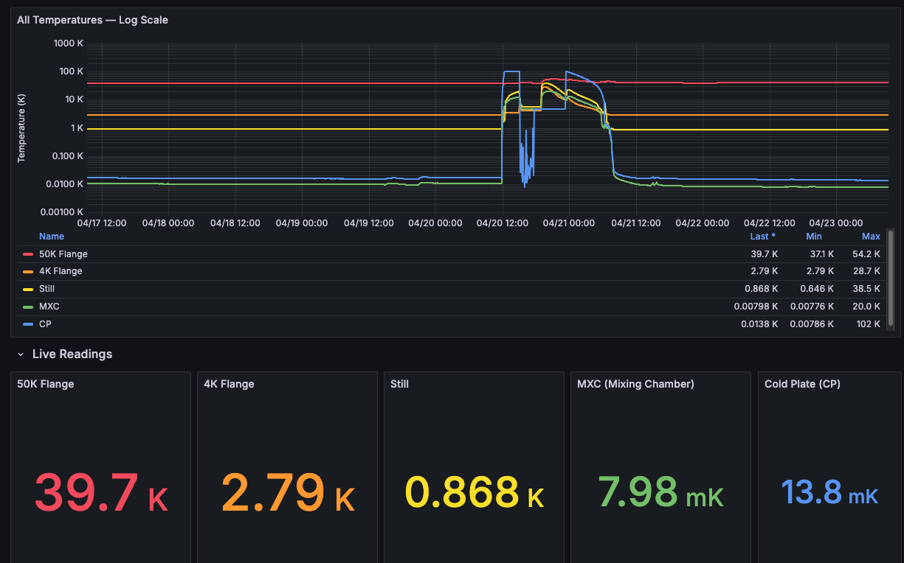
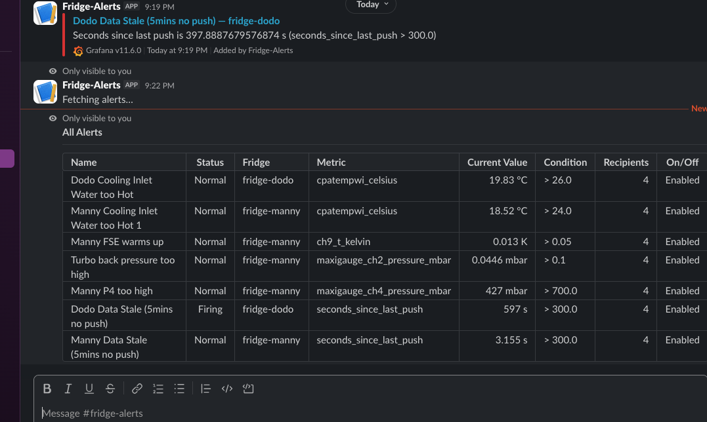

# Fridge Monitor — Server Stack

### Alertui


### Temperature Dashboard


### Slack command


Monitoring stack for Wang Lab dilution refrigerators. Receives temperature and
pressure metrics from fridge computers, stores them in Prometheus, and displays
them in Grafana. Sends alerts via Slack and email.

**Fridges:** Manny (Bluefors), Dodo (Bluefors), Sid (Oxford Instruments — pending)

---

## Quickstart

```bash
cp .env.example .env
nano .env          # set GF_ADMIN_PASSWORD at minimum; see comments for all options

./install.sh       # pulls images, starts stack, runs health checks, prints URLs
```

Grafana will be available at `http://localhost:3000` locally, or at
`https://fridge.zickers.us` in production.

**Fridge computers:** set `PUSHGATEWAY_URL=http://<server-ip>:9091` in each
fridge's `server.env`.

---

## Prerequisites

- Docker Engine with Compose plugin (`docker compose version` must work)
- `gettext` for `envsubst`: `apt install gettext` / `pacman -S gettext`
- `jq`: `apt install jq` / `pacman -S jq`
- `ufw` installed and enabled (used for Pushgateway access control)
- Ports 8443 and 9091 forwarded at the router (see Network & Firewall below)

---

## Network & Firewall Configuration

There are three independent layers: **service port bindings** (what Docker exposes and to
whom), **host firewall** (ufw rules), and **router port forwarding** (what
reaches the server from the internet).

---

### Layer 1 — Service port bindings

Not all services need to be reachable from outside the server. The stack is
deliberately split between public-facing and localhost-only:

| Port | Service | Bound to | Accessible from |
|------|---------|----------|-----------------|
| 8443 | Caddy (Grafana HTTPS) | `0.0.0.0` | Anywhere — intentionally public |
| 9091 | Pushgateway | `0.0.0.0` | Anywhere — guarded by ufw (Layer 2) |
| 3000 | Grafana (HTTP) | `127.0.0.1` | Localhost only |
| 9090 | Prometheus | `127.0.0.1` | Localhost only |
| 9093 | Alertmanager | `127.0.0.1` | Localhost only |

Prometheus and Alertmanager have **no authentication**. Binding them to
`127.0.0.1` prevents any external access — they are internal services only.
Grafana is exposed externally only through Caddy on 8443 (TLS). Port 3000
remains on localhost for health checks and local debugging.

**Fridge computers push metrics directly to port 9091** (Pushgateway), so
that port must be reachable from the college network. ufw restricts which IPs
can reach it. Port 8443 is open to all for Grafana web access.

Do not add router forwarding rules for 3000, 9090, or 9093.

---

### Layer 2 — Host firewall (ufw)

`install.sh` configures ufw automatically when `ALLOWED_PUSH_CIDR` is set in
`.env`. This is what it applies and why.

#### Rules applied by install.sh

```bash
ufw insert 1 allow from <ALLOWED_PUSH_CIDR> to any port 9091 proto tcp
ufw deny 9091
```

The `insert 1` is critical — it places the allow rule **before** the deny rule.
ufw evaluates rules top-to-bottom and stops at the first match. If the deny
rule appears above the allow rule, the college network gets blocked too.

#### Expected ufw state after install

```
$ sudo ufw status numbered
Status: active

     To                         Action      From
     --                         ------      ----
[ 1] 9091/tcp                   ALLOW IN    128.119.0.0/16   ← college CIDR (must be first)
[ 2] 9091/tcp                   DENY IN     Anywhere         ← blocks everyone else
```

If the DENY appears before the ALLOW, re-run `./install.sh` to reapply in the
correct order, or fix manually:

```bash
sudo ufw status numbered          # note the rule numbers
sudo ufw delete <deny-rule-num>   # remove the misplaced deny
sudo ufw delete <allow-rule-num>  # remove the allow too
sudo ufw insert 1 allow from 128.119.0.0/16 to any port 9091 proto tcp
sudo ufw deny 9091
```

Note: rule numbers shift after each deletion — re-run `ufw status numbered`
between deletions.

#### ALLOWED_PUSH_CIDR

Set this in `.env` before running `install.sh`:

```bash
ALLOWED_PUSH_CIDR=128.119.0.0/16   # UMass Amherst college network
```

Known fridge IPs for reference:
- `128.119.101.1` — Sid (Bluefors)
- `128.119.77.226` — Manny (Bluefors)

If `ALLOWED_PUSH_CIDR` is empty, `install.sh` warns and leaves port 9091 open
to all — acceptable during initial setup, should be filled in once confirmed.

#### Adding local network access to Pushgateway

To push test metrics from the same LAN (e.g. during setup or debugging):

```bash
sudo ufw insert 1 allow from 192.168.1.0/24 to any port 9091 proto tcp
```

Insert as rule 1 so it appears before the college CIDR allow. Both can coexist.

---

### Layer 3 — Router port forwarding

Two ports must be forwarded at the router to reach the server from outside the
home network.

#### Required forwarding rules

| External port | Internal port | Protocol | Destination | Purpose |
|---------------|---------------|----------|-------------|---------|
| 8443 | 8443 | TCP | server LAN IP | Grafana HTTPS — public |
| 9091 | 9091 | TCP | server LAN IP | Pushgateway — fridge computers |

#### Setup steps

1. **Assign the server a static LAN IP** via DHCP reservation ("static lease")
   in your router so the forwarding target never changes after a reboot.
   Find the current IP: `hostname -I | awk '{print $1}'`

2. **Add the forwarding rules** in your router admin panel (usually at
   `192.168.1.1`). The setting is often labelled "Port Forwarding", "NAT",
   "Virtual Server", or "Applications & Gaming" depending on the router.

3. **Verify from outside the LAN** (e.g. a phone on mobile data, or a remote
   machine not on the home network):
   ```bash
   # Grafana — should return HTTP 200 with a valid Let's Encrypt cert
   curl -I https://fridge.zickers.us:8443

   # Pushgateway — should return "OK" (run from college network or VPN)
   curl http://fridge.zickers.us:9091/-/healthy

   # Pushgateway — should be blocked (run from a non-college IP)
   curl --max-time 5 http://<server-public-ip>:9091/-/healthy
   ```

---

### DNS chain

How `fridge.zickers.us` resolves to this server:

```
fridge.zickers.us        (name.com — ANAME record)
  └─► zickers-fridge.duckdns.org   (updated every 5 min by the duckdns container)
        └─► <server public IP>
```

- The **duckdns** container keeps `zickers-fridge.duckdns.org` pointed at the
  server's current public IP. Register and get your token at [duckdns.org](https://www.duckdns.org).
- An **ANAME record** on [name.com](https://www.name.com) points `fridge.zickers.us` at the DuckDNS
  subdomain. When the IP changes, DuckDNS updates within 5 minutes automatically.
- **Caddy** obtains the TLS cert via DNS-01 challenge using the name.com API — no port 80 needed.

Verify DuckDNS is running:
```bash
docker compose logs duckdns | tail -20   # should show periodic "OK" responses
nslookup zickers-fridge.duckdns.org      # should match current public IP
```

---

### Full verification checklist

Run after initial setup or any network change:

```bash
# 1. ufw: ALLOW before DENY for port 9091
sudo ufw status numbered

# 2. Services bound to correct interfaces
ss -tlnp | grep -E '8443|9091|3000|9090|9093'
# Expect: 8443 and 9091 on 0.0.0.0, everything else on 127.0.0.1

# 3. DuckDNS resolving to current public IP
nslookup zickers-fridge.duckdns.org

# 4. TLS cert valid and issued by Let's Encrypt
curl -Iv https://fridge.zickers.us:8443 2>&1 | grep -E 'subject|issuer|expire'

# 5. Grafana reachable over HTTPS
curl -o /dev/null -s -w "%{http_code}\n" https://fridge.zickers.us:8443
# Expect: 200

# 6. Pushgateway reachable from college network
#    (run from a machine on 128.119.0.0/16, e.g. a fridge computer or college VPN)
curl http://fridge.zickers.us:9091/-/healthy
# Expect: OK

# 7. Pushgateway blocked from non-college IPs
#    (run from home network or mobile data — should time out or be refused)
curl --max-time 5 http://<server-public-ip>:9091/-/healthy
```

---

## Managing the stack

```bash
# Stop
docker compose down

# Restart a single service
docker compose restart grafana

# View logs
docker compose logs -f grafana
docker compose logs -f duckdns

# Update config and apply (safe to re-run)
nano .env
./install.sh
```

