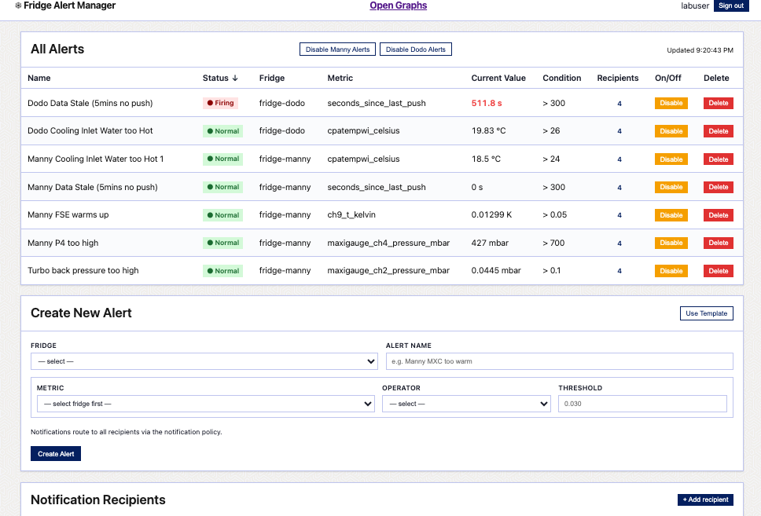
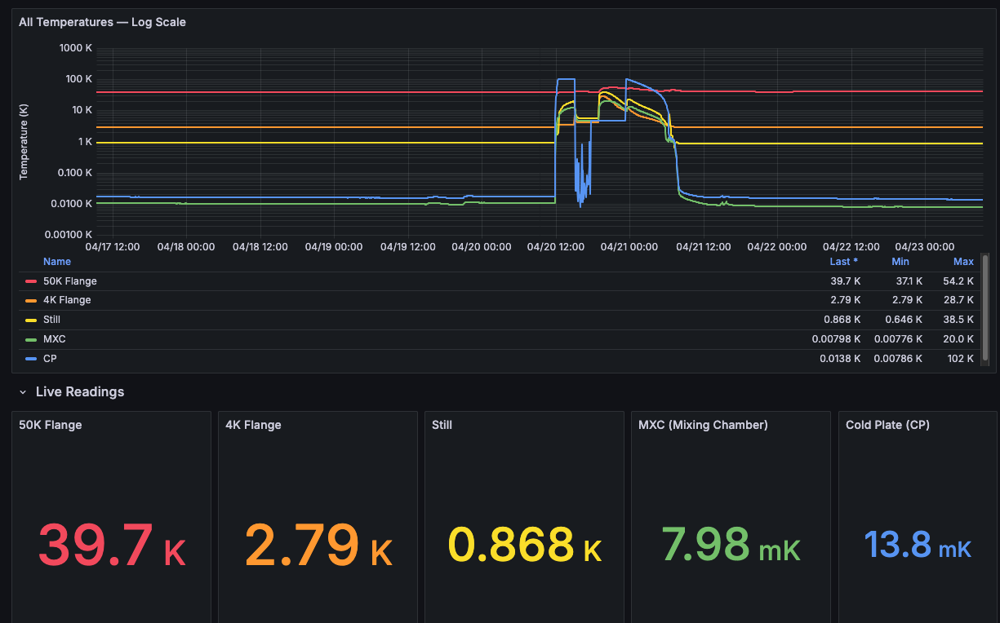
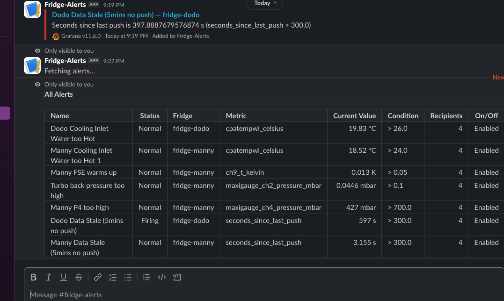

# Fridge Monitor Server
[](https://github.com/xoth42/Fridge-server/actions/workflows/docs.yml)

Monitoring and alerting stack for Wang Lab dilution refrigerators. Fridge
computers push sensor metrics to Pushgateway; Prometheus stores them; Grafana
shows dashboards and evaluates user-created alert rules; alerts can be delivered
by email and Slack.

Currently configured fridges:

- Manny (`fridge-manny`)
- Dodo (`fridge-dodo`)

Sid/Oxford support is not wired into the live metric config yet.

## Screenshots

### Alert UI



### Grafana Dashboard



### Slack Integration



## What Runs

The live stack is defined in `docker-compose.yml`:

| Service | Purpose | Host access |
| --- | --- | --- |
| `prometheus` | Scrapes Pushgateway and stores metrics | `127.0.0.1:9090` |
| `pushgateway` | Receives metric pushes from fridge computers | `0.0.0.0:9091` |
| `grafana` | Dashboards, users, contact points, alert rules | `127.0.0.1:3000` |
| `alertmanager` | Prometheus Alertmanager for template-based routes | `127.0.0.1:9093` |
| `alert-api` | FastAPI proxy used by the custom alert UI | `127.0.0.1:8000` |
| `caddy` | Public HTTPS reverse proxy for Grafana and `/alerts/` | `0.0.0.0:8443` |
| `duckdns` | Keeps the dynamic DNS name updated | no published port |
| `watchtower` | Monitor-only container update emails | no published port |

Grafana is the main alert-rule engine for fridge-specific alerts. Prometheus
also loads `config/prometheus/alerts.yml`, but that file is currently empty
apart from comments.

## Quick Start

```bash
cp .env.example .env
$EDITOR .env
./install.sh
```

At minimum, set a real `GF_ADMIN_PASSWORD`. For production, also configure the
domain, public URL, SMTP credentials, Slack webhook/signing secret, DuckDNS,
name.com API credentials, and `ALLOWED_PUSH_CIDR`.

The installer is idempotent and safe to re-run after config changes. It:

- checks Docker Compose, `jq`, and `envsubst`
- sources `.env`
- generates `config/alertmanager/alertmanager.runtime.yml`
- applies `ufw` rules for Pushgateway when `ALLOWED_PUSH_CIDR` is set
- pulls upstream images and rebuilds local Caddy/API images
- starts the stack
- waits for Prometheus, Pushgateway, Alertmanager, and Grafana health checks
- optionally creates the Grafana lab user
- runs `install_alert_ui.sh --skip-e2e` by default

To run the intrusive alert UI end-to-end test during install:

```bash
RUN_E2E=true ./install.sh
```

## URLs

After a local install:

- Grafana: `http://localhost:3000`
- Alert UI through Caddy: `https://<DOMAIN>/alerts/`
- Prometheus: `http://localhost:9090`
- Alertmanager: `http://localhost:9093`
- Pushgateway: `http://<server-ip>:9091`

In the current production-style example, `GRAFANA_PUBLIC_URL` is
`https://fridge.zickers.us:8443`.

Each fridge computer should set:

```bash
PUSHGATEWAY_URL=http://<server-ip-or-domain>:9091
```

## Configuration

Important files:

| Path | Role |
| --- | --- |
| `.env.example` | Template for all deployment secrets and runtime options |
| `docker-compose.yml` | Container topology, ports, volumes, and environment |
| `config/prometheus/prometheus.yml` | Prometheus scrape config |
| `config/prometheus/alerts.yml` | Prometheus rule file, currently empty |
| `config/grafana/provisioning/` | Grafana datasources, dashboards, contact points, policies, templates |
| `alert-api/metrics.yml` | Allowed fridges, metrics, units, operators, and custom PromQL expressions |
| `config/caddy/Caddyfile` | HTTPS reverse proxy for Grafana and the alert UI |
| `config/alertmanager/alertmanager.yml.template` | Source template for generated Alertmanager config |
| `alert-ui/` | Static custom alert-management frontend |
| `alert-api/` | FastAPI backend used by the alert UI and Slack command |

Do not edit `config/alertmanager/alertmanager.runtime.yml` directly. It is
generated from `config/alertmanager/alertmanager.yml.template` whenever
`install.sh` runs.

## Alert Management

The custom alert UI lives at `/alerts/`. It signs users in with Grafana
username/password credentials and sends those credentials to `alert-api` as
HTTP Basic auth. The API validates credentials against Grafana, then uses the
installer-managed Grafana service account token to create, delete, disable, and
route alert rules.

`install_alert_ui.sh` maintains the required Grafana service account:

- ensures an `alert-api` service account exists
- upgrades it to Admin when needed
- rotates the managed token if the stored token is missing or stale
- writes `GRAFANA_SA_TOKEN` back to `.env`
- rebuilds the Grafana notification policy through the API

The available alert dropdowns come from `alert-api/metrics.yml`. To add a new
fridge or metric to the Alert UI, update that file and restart/rebuild the API:

```bash
docker compose up -d --build alert-api
```

Slack slash commands are handled at `/alerts/api/slack/commands` and require
`SLACK_SIGNING_SECRET`.

## Network And Firewall

There are three layers to keep straight:

1. Docker port bindings
2. host firewall rules
3. router port forwarding

The intended exposure is:

| Port | Service | Exposure | Notes |
| --- | --- | --- | --- |
| `8443/tcp` | Caddy | public | HTTPS entrypoint for Grafana and `/alerts/` |
| `9091/tcp` | Pushgateway | restricted | fridge computers push metrics here |
| `3000/tcp` | Grafana | localhost only | reached publicly through Caddy |
| `9090/tcp` | Prometheus | localhost only | unauthenticated internal service |
| `9093/tcp` | Alertmanager | localhost only | unauthenticated internal service |
| `8000/tcp` | Alert API | localhost only | reached publicly through Caddy `/alerts/api/*` |

When `ALLOWED_PUSH_CIDR` is set, `install.sh` inserts an allow rule before a
deny rule:

```bash
sudo ufw status numbered
```

Expected order:

```text
[ 1] 9091/tcp  ALLOW IN  <ALLOWED_PUSH_CIDR>
[ 2] 9091/tcp  DENY IN   Anywhere
```

Forward only `8443/tcp` and `9091/tcp` from the router to the server. Do not
forward Grafana, Prometheus, Alertmanager, or Alert API directly.

## DNS And TLS

The intended production chain is:

```text
fridge.zickers.us
  -> zickers-fridge.duckdns.org
      -> current public IP
```

The `duckdns` container keeps the DuckDNS record current. Caddy obtains the TLS
certificate with a DNS-01 challenge through the name.com API, so inbound port 80
is not required.

Useful checks:

```bash
docker compose logs duckdns | tail -20
nslookup zickers-fridge.duckdns.org
curl -Iv https://fridge.zickers.us:8443
```

## Operations

```bash
# Apply config changes or update local images
./install.sh

# Stop the stack
docker compose down

# Restart one service
docker compose restart grafana

# Rebuild and restart local-code services
docker compose up -d --build alert-api caddy

# View logs
docker compose logs -f grafana
docker compose logs -f alert-api
docker compose logs -f caddy

# Check containers
docker compose ps
```

Health endpoints:

```bash
curl http://localhost:9090/-/ready
curl http://localhost:9091/-/healthy
curl http://localhost:9093/-/healthy
curl http://localhost:3000/api/health
curl http://localhost:8000/api/health
```

## Validation Notes

`testdata/` contains helper scripts for pushing sample metrics and checking
Prometheus/Grafana objects. Some older validation helpers still mention stale
provisioned alert-rule files, so prefer the installer health checks and direct
service checks above unless you have refreshed those scripts for the current
tree.

The repo also contains `planning/`, `slackapp/references/`, `html-renders/`,
and old test/prototype folders. Those are useful historical context, but the
runtime stack is the code and config listed in this README.
